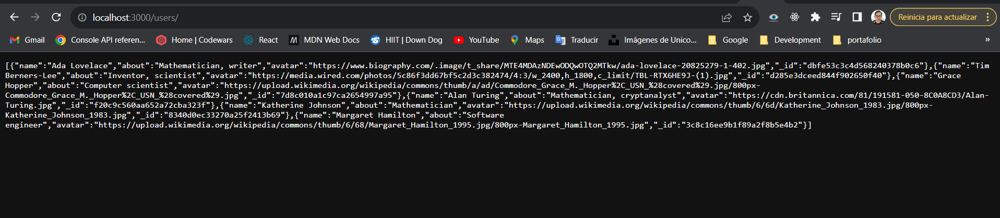
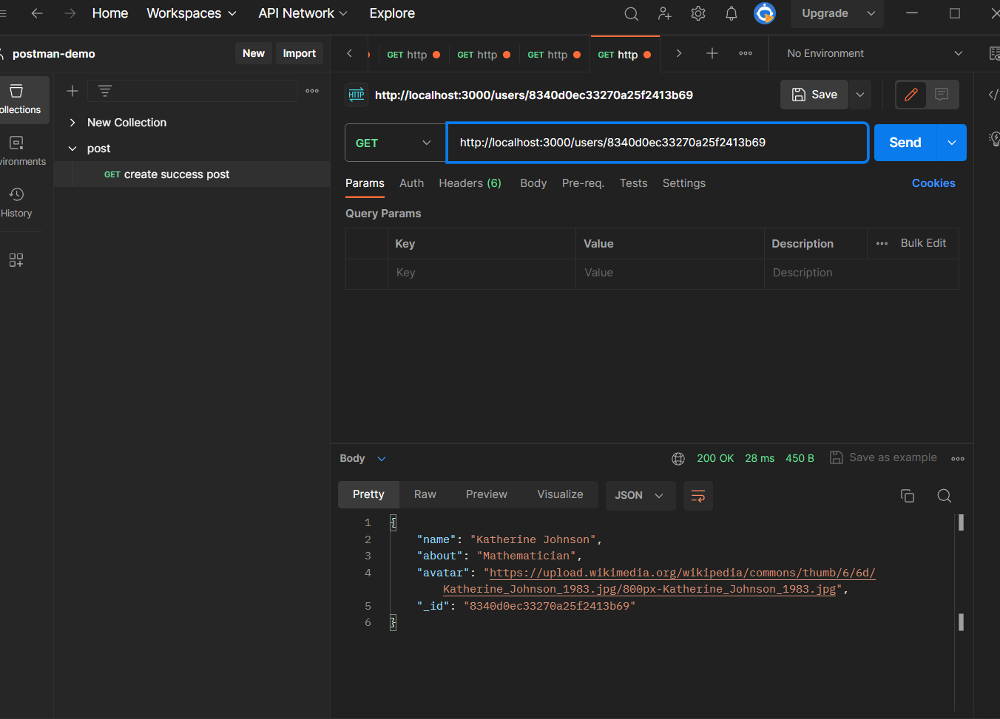

# Tripleten web_project_around_express

### Descripción general

- Autor
- Introduccion
- Tecnologias Utilizadas
- Imágenes
- Enlace web - Github page

# Autor

    Carlos Gómez
    'cgomezhub'
    cgomezlugo@hotmail.com
    058 416 953 4983

**Introducción**

Este es un proyecto se pone nuevamente en practica la teoria de modulos de Node.js basados en el framework Express.js para crer un servidor de prueba. Se importan  los  modolos express, fs y  path  y con sus respectivas funcionalidades Router, readfile entre otros. finalmente  Se prueba la aplicacion aplicando rutas como  http://localhost:3000/users en la barra de navegacion asi como en Postman

**Tecnologias Utilizadas**

    **Node.js**

    **Express.js**    

    **Java.Script**
   

**Imágenes**

.

.

**Videos**

.
.
.

